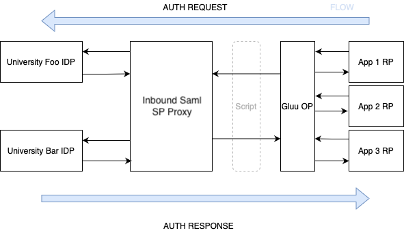

# Inbound Saml
[](https://codecov.io/gh/GluuFederation/inbound-saml)
[](https://www.codacy.com/gh/GluuFederation/inbound-saml/dashboard?utm_source=github.com&amp;utm_medium=referral&amp;utm_content=GluuFederation/inbound-saml&amp;utm_campaign=Badge_Grade)
[](https://github.com/GluuFederation/inbound-saml/actions)
[](https://github.com/GluuFederation/inbound-saml/actions)

```ascii                                                
             -/:`                         
             sss-                         
             sss-                         
  ------.`   sss-                         
 :ssssssss/` sss-`oso`   +ss.`oso`   +ss. 
 :sso:.-+ss+ sss-`sss.   oss-`sss.   oss- 
 /sso`  :sso sss-`sss.   oss-`sss.   oss- 
 `osssoosss- sss- +sso::+sss- +sso::+sss- 
   -/++osss/ oss.  :osssssss.  :ossssoss. 
  .-----+sso  `      ```` ``      ``` ``  
 :ssssssss+.                              
  .------`                                        
```

This module is responsible for acting as a single SP proxy.

It's initially intended to be used by [gluu-server](https://gluu.org):



## Features

  - ✅ Automatic fetch remote IDP data from metadata
  - [ ] Automatic remote idp key rotation handling
  - ✅ Expose single metadata to be consumed by all remote IDPs
  - ✅ Create (register) Trust Relation and remote IDP provider providing metadata url
  - [ ] SP initiated authentication
  - [ ] IDP initiated authentication

## Developing

Please check [`CONTRIBUTING.md`](CONTRIBUTING.md)

## Internal Reusable Modules

  Independent modules:
  
  - [`@get-saml-metadata`](src/get-saml-metadata)

## Support

You can ask and find related questions in [gluu community support portal](https://support.gluu.org)
